# Application Deployment on Kubernetes Cluster using Jenkins DSL Pipeline

The most tiresome work is to wait for someone. The project automates the tasks from the process of Job creation for testing and production environment to testing the application. Web Application Deployment is automated using Jenkins Seed Job in DSL Language on Kubernetes Cluster. Jenkins pipeline in Groovy language to implement different stages during the process of deployment.

**Project Infra Diagram**
<p align="center">
  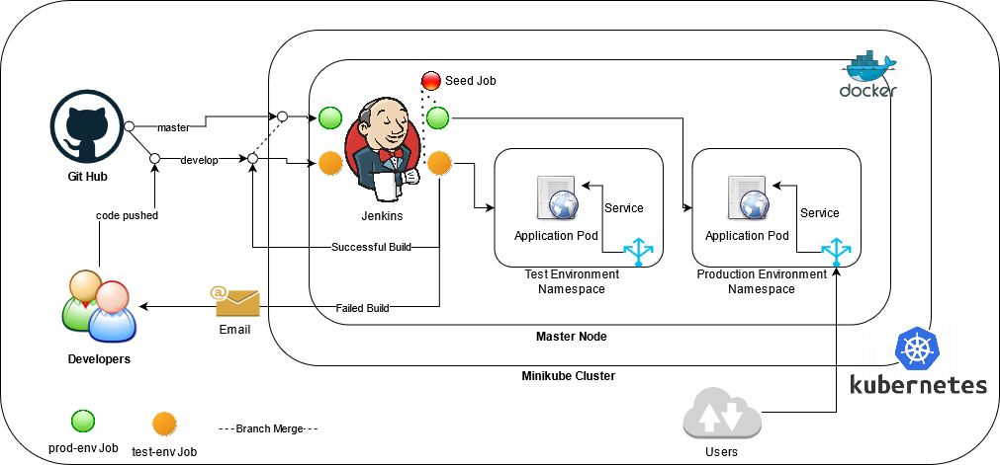
  <br>
  <em>Fig 1.: Infra Diagram </em>
</p>


## Pre-requisites
- Kubernetes Cluster


### Jenkins Image using Dockerfile

The Dockerfile is created from the `alpine:latest` linux image minimising the storage required to run the jenkins container. The image contains the kubectl binary to launch the kubernetes resources. The files for authentication is copied in the image. You can create the custom image using the already provided image `riteshsoni296/jenkins_kubectl:v2` and paste the kubernetes authentication files i.e; client.crt,client.key and ca.crt. The kubectl *config.template* file is present in the scripts/Jenkins_image directory in the repository

The dockerfile extract to be as follows :

```
FROM riteshsoni296/jenkins_kubectl:v2
COPY client.crt client.key ca.crt config.template /root/.kube/
EXPOSE 8080
CMD /bin/sh -c "envsubst \"`env | awk -F = '{printf \" \\\\$%s\", \$1}'`\" < /root/.kube/config.template \
    > /root/.kube/config  && java -jar /usr/share/webapps/jenkins/jenkins.war"
```

The dockerfile should always start with `FROM` instruction. The FROM instruction specifies the Parent Image from which we are building. The `RUN` instruction is used to execute the shell commands during the build creation. The `ENV` instruction is used to set environment variables for the image. The `EXPOSE` instruction is used to perform Port Address Translation in the container i.e; exposing a service to the outside world. The `CMD` instructions are executed at the run time i.e during the container creation. 


The image can be easily created using  dockerfile using `docker build` command. 

```
mkdir /opt/jenkins
cd /opt/jenkins

# Create file name Dockerfile with the earlier mentioned steps and copy the files for cluster authentication.

docker build -t jenkins:v1 /opt/jenkins/ --network=host
```

*-t* parameter denotes the tag for the image

*/opt/jenkins* represents the directory that consists Dockerfile.


Initialising **jenkins container** using image on kubernetes cluster. The kubernetes configuration file for jenkins server will launch resources as  follows:

*a. Namespace*

    To launch all the resources in custom namespace
 
*b. Service*
  
    To connect with the jenkins pods from outside world.
    
*c. PersistentVolumeClaim*

    For persistentency of data in Jenkins Server pods to preserve the data in case of pod failure.

*d. Deployment*

    Deployment resource maintains and monitors the pods. It restarts the pods in case of fault-tolerance.
 
The configuration file for `Jenkins Server Resources` is present in the repository at `scripts/kubernetes_resources` directory. 

```
kubectl create -f jenkins_deployment.yml
```

The kubernetes resources created for jenkins server pods are as shown in below figure

<p align="center">
  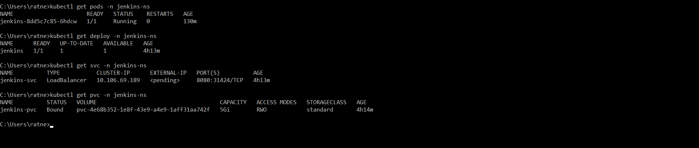
  <br>
  <em>Fig 2.: Jenkins Kubernetes Resources  </em>
</p>

The jenkins container data directory `/var/lib/jenkins` is mounted using PVC for data persistency to avoid data loss during unavoidable circumstances.

During the initialisation of jenkins server for the first time, the Jenkins server proides `secret key` in the console logs for the first time login.

<p align="center">
  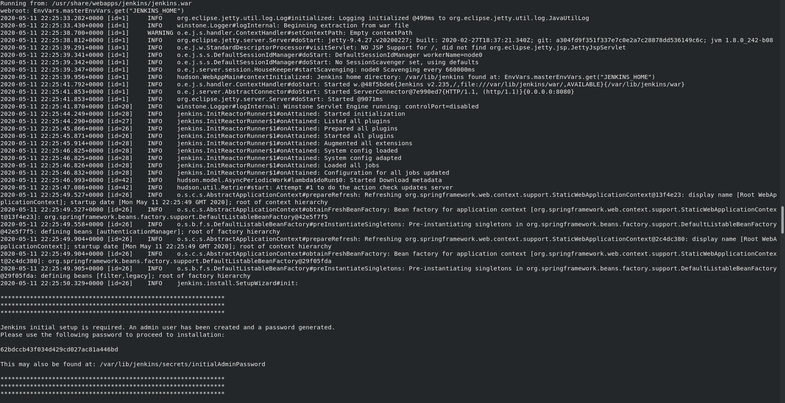
  <br>
  <em>Fig 3.: Jenkins Server Startup  </em>
</p>

<p align="center">
  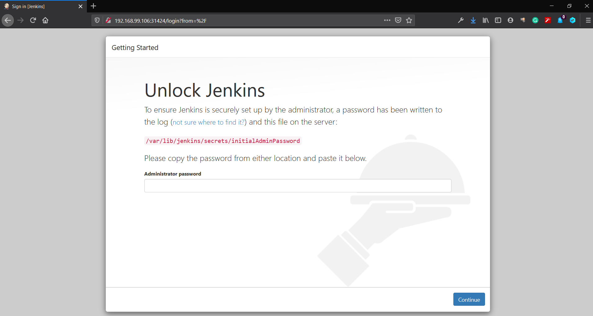
  <br>
  <em>Fig 4.: Jenkins Initial Login Page </em>
</p>

### Jenkins Plugins to be installed
- pipeline
- pipeline utility
- github
- jenkins-dsl

## Disable Script Security for Job DSL Scripts

In this project, the DSL script present in the code repository is being used to configure the jobs. So, to enable script execution, we need to disable DSL Script security. The Steps to be followed to disable `Script Security` are as follows:

1. Click on `Manage Jenkins` in Jenkins Welcome Page

2. Click on `Configure Global Security`

<p align="center">
  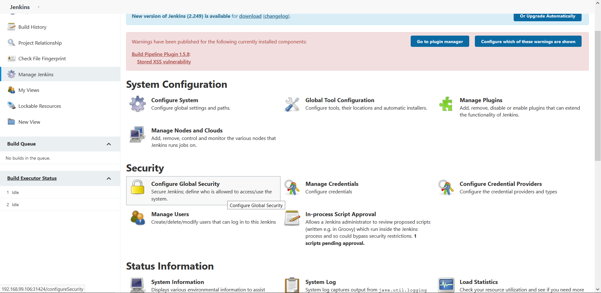
  <br>
  <em>Fig 5.: Configure Security </em>
</p>

3. Unlick the Checkbox under `CSRF Protection`

The DSL Script security is disabled by unchecking the checkbox with label `Enable Script Security for Job DSL Scripts` under `CSRF Protection`.

<p align="center">
  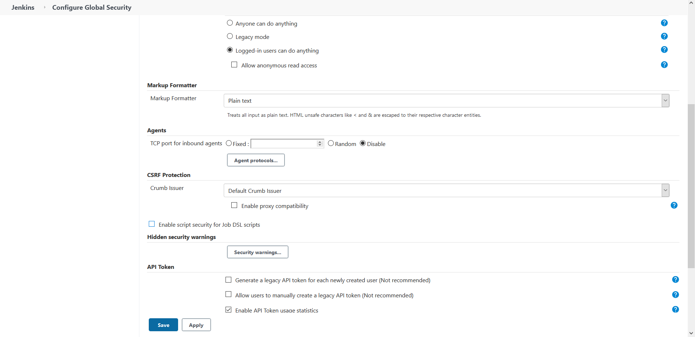
  <br>
  <em>Fig 6.: Disable DSL Security </em>
</p>


### Configure DockerHub Credentials

We need to configure the docker hub credentials repository where we will be uploading the latest application image. The following  steps to configure the credentials in JENKINS Server.

1. Click on *Manage Jenkins* in Jenkins Welcome Page

2. Click on *Manage Credentials*

<p align="center">
  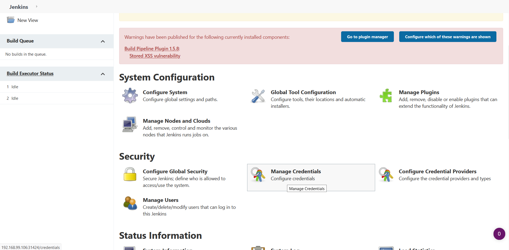
  <br>
  <em>Fig 7.: Manage Credentials  </em>
</p>

3. Click on *domains* below global column

<p align="center">
  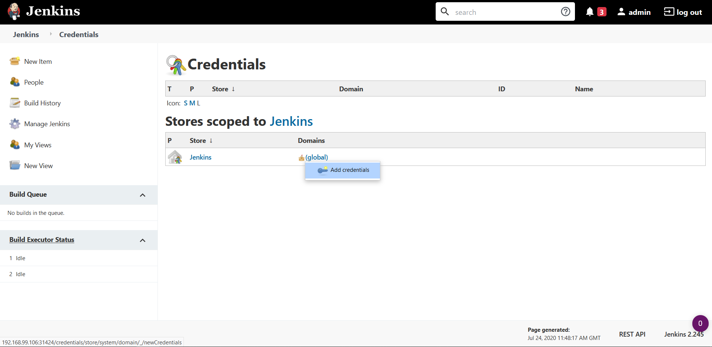
  <br>
  <em>Fig 8.: Configure Credentials in Jenkins  </em>
</p>

4. Configure the Username and Password of Docker Hub Repository

    We will be providing the docker hub repository username and password.
    
<p align="center">
  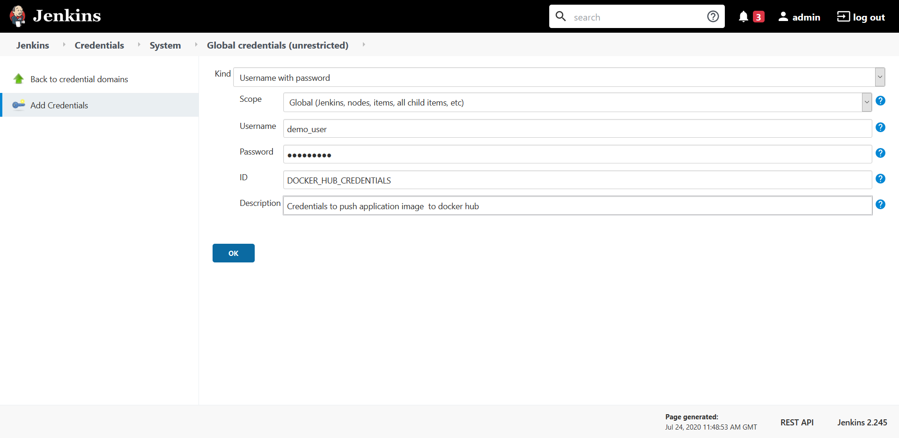
  <br>
  <em>Fig 9.: Add Credentials in Jenkins  </em>
</p>


**Similiarly configure the GITHUB_CREDENTIALS in Jenkins Server** This is `neccesary` to `merge` *develop branch* code to *master branch* if the application testing succeeds for code in develop branch


## Configure Jenkins Seed Job 

The Jenkins Seed Job is configured in Domain Specific Language (DSL).  The seed job configures the Jenkins Pipeline Job for Production and Testing Environment using Groovy language.
The Jenkins Seed Job is configured and executed  `only once`. 

Steps to create the `jenkins_seed_job` job are as follows:

1. Create a *New Item* at the left column in Jenkins Welcome page

2. Configure *Job Name*

<p align="center">
  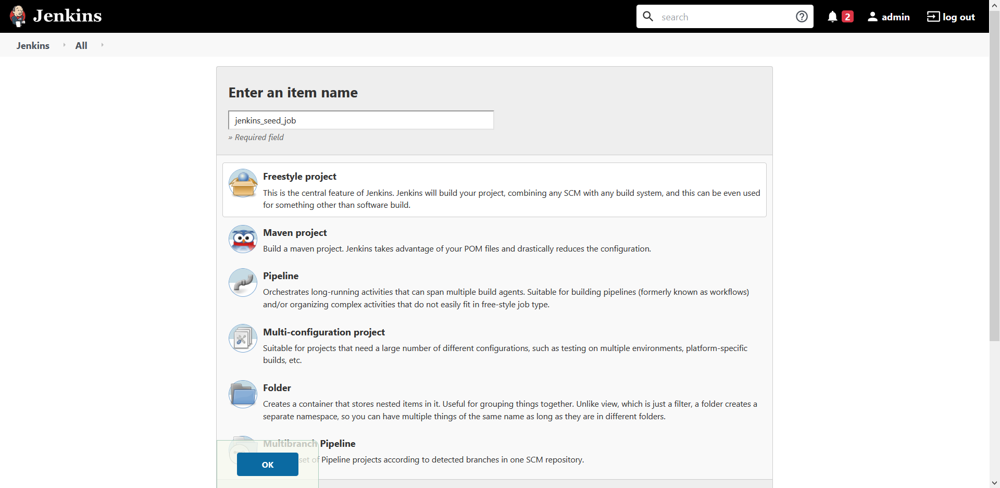
  <br>
  <em>Fig 10.: Job Name Configuration  </em>
</p>

3. Configure *GitHub Project URL*

The DSL script is uploaded in the Code repository. So the DSL scipt will be referenced in the job.

4. Configure **Source Code Management**

  We are only tracking the master branch, since the code is pushed finally in master branch.

<p align="center">
  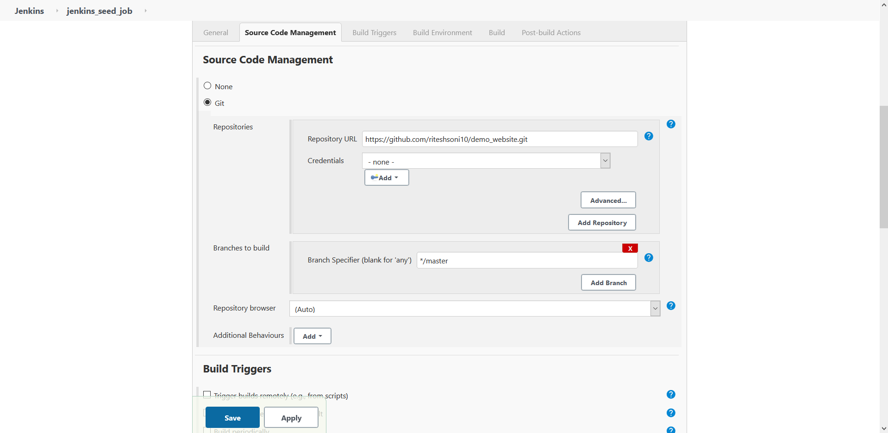
  <br>
  <em>Fig 11.: Source Code Management Configuration  </em>
</p>

5. Steps to perform at **Build Stage**

   From the **Add Build Step** drop-down, `Process Job DSLs` is selected to run the operations at build stage. The groovy script contains job details which is configured on its first run. The `GIT_URL` is fetched from the environment variables in the script using following
```
getBinding().getVariables()['GIT_URL']
```

The pipeline Job will be created as a result of function `pipelineJob(String)`. The script is present in scripts directory in this repository with name 'jenkins_job.groovy'. The similiar script in uploaded in the code repository.
 
 <p align="center">
  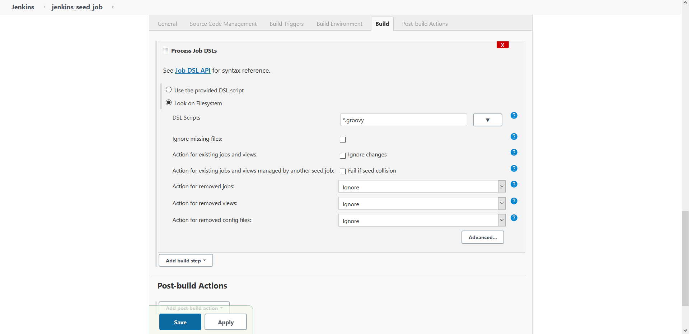
  <br>
  <em>Fig 12.: DSL Build Stage  </em>
</p>

7. Click on Apply and Save


**On Execution of jenkins_seed_job, two new jobs are created i.e `prod-env` and `test-env` for production and test environments.**

The Production job i.e `prod-env`, configured for monitoring the code in `master` branch whereas, the `test-env` job monitors the code in `develop` branch.

The production Job which is created is as shown below. In a similiar manner, with just a difference of `Branches to build` parameter to be `*/develop` is configured.

1. *GitHub Project URL*
 <p align="center">
  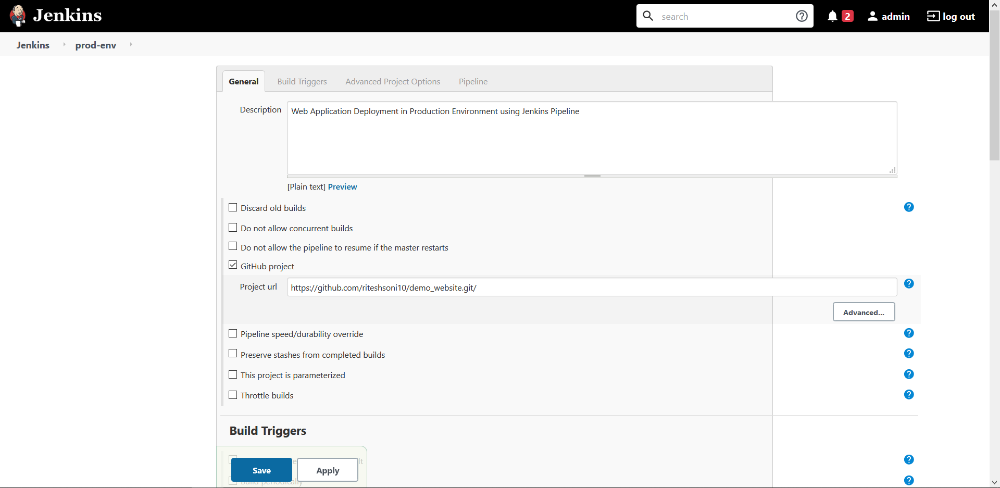
  <br>
  <em>Fig 13.: Project URL  </em>
</p>

2. *Build Triggers*

Build triggers notify when the job will be executed.  For now, Poll SCM variable is used, since the jenkins is in the private network and github is hosted in public network.
    
   `Poll SCM trigger` checks for any changes in the branch of the repository during the interval configured. Currently, the Poll SCM interval is configured to validate for changes in the branch at an interval of every minute.

 <p align="center">
  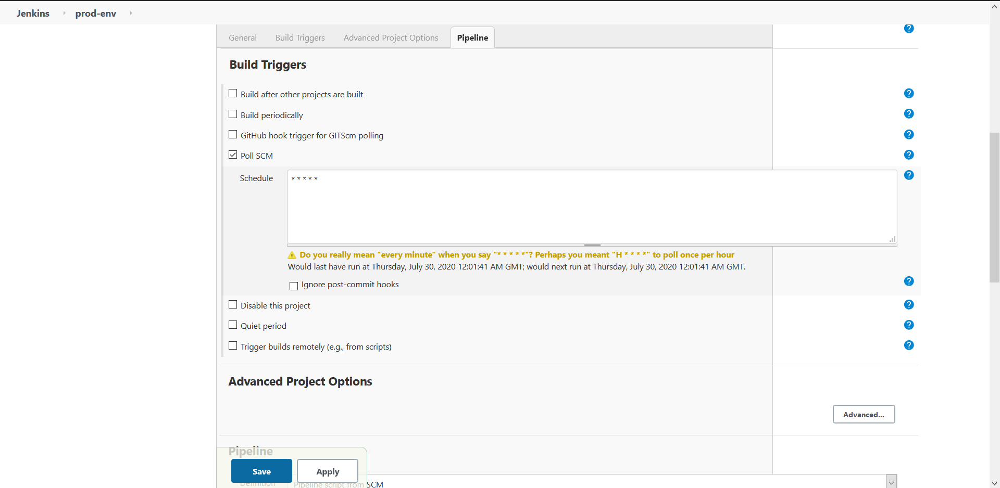
  <br>
  <em>Fig 14.: Build Triggers  </em>
</p>

3. *Pipeline Stage*

 <p align="center">
  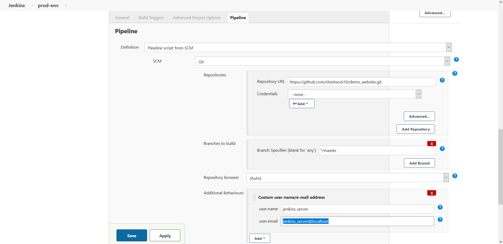
  <br>
  <em>Fig 15.: Pipeline Stage  </em>
</p>


## Understanding Jenkinsfile for Pipeline

In this project, two jenkins pipelines are created for `develop` and `master` branches respectively. Jenkins pipeline can be scripted in two ways i.e `scripted` and `declarative` approach. The project implements Declarative pipeline to execute different stages. The various stages for Production Environment Jenkins Job is explained below. The complete Jenkins pipeline script in uploaded in the current respository at location `scripts/jenkins_pipeline`.

**Stage 1:** Declarative Checkout

  In declarative pipeline, the SCM checkout stage is predefined i.e; it is not compulsory to define an different stage for checkout of the code repository.
  
 <p align="center">
  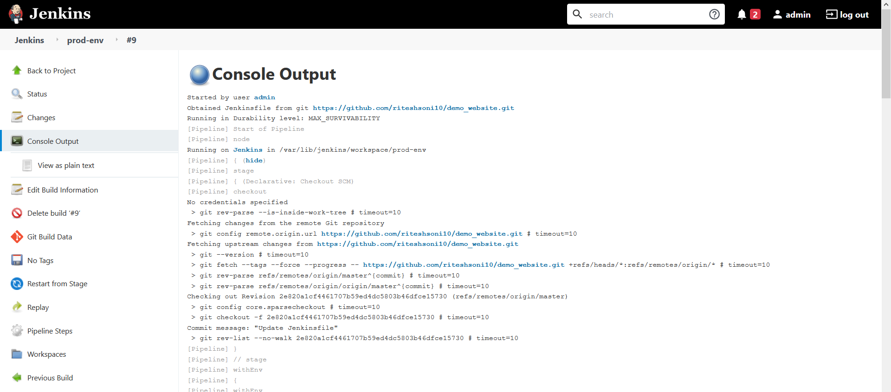
  <br>
  <em>Fig 16.: Checkout stage  </em>
</p>

**Stage 2:** Detect Code Base

  The stage deals with checking the code base of the code repository i.e the language of the code present in the repository. Currently it only detects HTMl and PHP code bases.
 
**Stage 3:** Build Image

The stage builds a new image whenever the Job is triggered whenever a SCM change is detected in the repository. The stage uses three variables i.e
  
  - `DOCKER_REPOSITORY` : Docker Hub Repository Name to push the Code Image
  
  - `CODE_BASE`: For Image Name for example: web-aplication
  
  - `IMAGE_VERSION`: Created based on `BRANCH` and `BUILD_NUMBER` i.e for example BUILD_NUMBER=10, in case master branch *RELEASE_v10*, whereas for develop branch *TEST_v10*.
      
  <p align="center">
  
  <br>
  <em>Fig 17.: Build Image stage  </em>
</p>
     
**Stage 4:** Image Repo Login

Docker Hub Login using credentials configured earlier.

**Stage 5:** Push Image

Pushes the image built in Stage 3 to Docker Hub repository.

  <p align="center">
  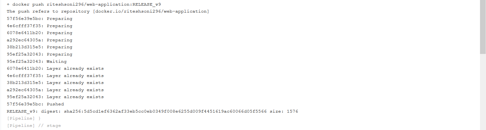
  <br>
  <em>Fig 18.: Push Image stage  </em>
</p>

**Stage 6:** Application Namespace

Kubernetes namespace resource based on job-name i.e prod-env and test-env; in case the namespace is not present its created.

**Stage 7:** Application Rollout

Checks for the deployment resource in Kubernetes in the application namespace as found in earlier stage. If the application deployment is present, then new application is rolled out otherwise the stage outputs message `Application is not yet deployed`.

  <p align="center">
  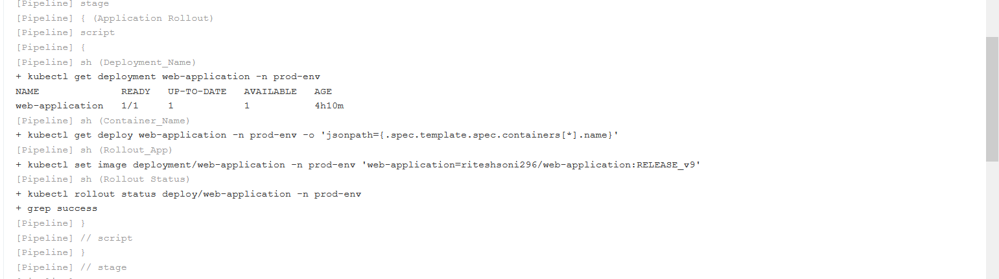
  <br>
  <em>Fig 19.: Application Rollout stage when application is already Deployed  </em>
</p>

  <p align="center">
  
  <br>
  <em>Fig 20.: Application Rollout stage when Application is not deployed  </em>
</p>

**Stage 8:** Application Deployment

This stage executes only if the above stage returns message `Application is not yet deployed`. This stage creates the new deployment for the application and exposes the applicaton using Service resource.

 <p align="center">
  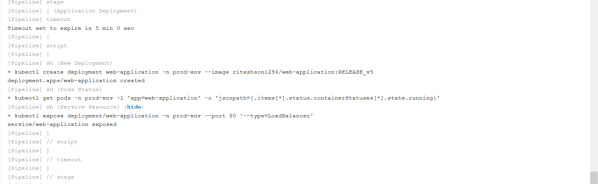
  <br>
  <em>Fig 21.: Application Deployment stage  </em>
</p>


**Stage 9:** Application Testing

Currently this stage tests the application bases on the `HTTP_STATUS` code returned when hitting the application URL. The post stage steps are defined in this stage to either send and email to commiter in case of test failure or merge the branch to master if the current_branch is `develop` and the application test is successful

 <p align="center">
  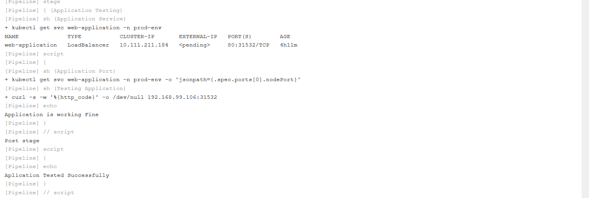
  <br>
  <em>Fig 22.: Application Testing stage  </em>
</p>

`Post Stage Steps` 

a. Success

In case, the current branch is `develop`, then develop branch code is merged with the master branch and push to the remote repository.

b. Failure

An email is sent to the commiter's email with the build result and logs to further analysis.


 <p align="center">
  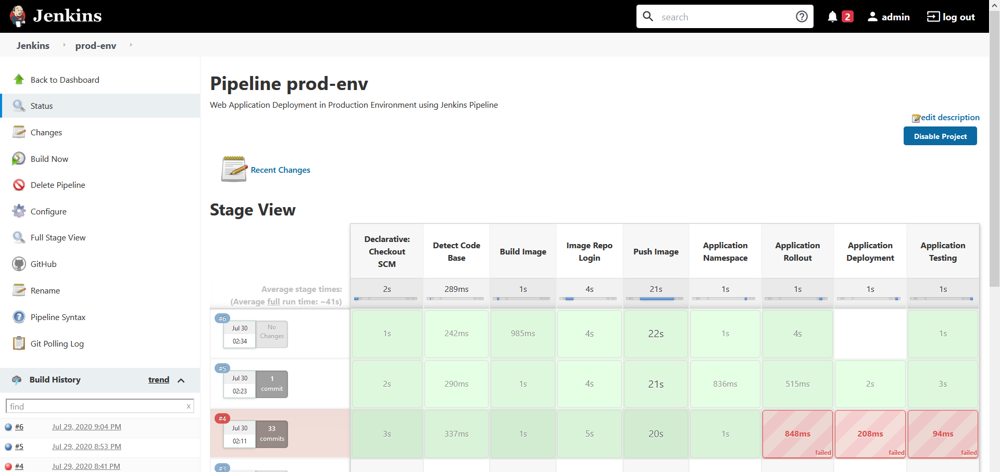
  <br>
  <em>Fig 23.: Production Pipeline Stages  </em>
</p>


In the above image, 
    
  - Build Number 5 represents `first time application deployment`
   
  - Build Number 6  represents when the rollout of `application already deployed` is preformed.
  
 Application Resources on Kubernetes Cluster
 
 <p align="center">
  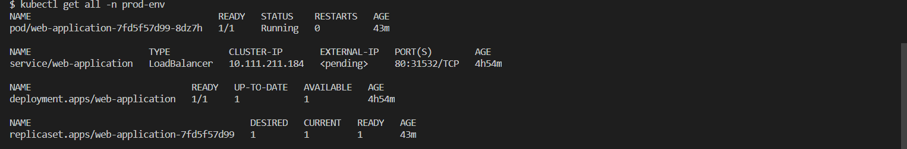
  <br>
  <em>Fig 16.: Application Resources </em>
</p>


> Source: LinuxWorld Informatics Pvt. Ltd
>
> Under guidance of: [Mr. Vimal Daga](https://in.linkedin.com/in/vimaldaga)
